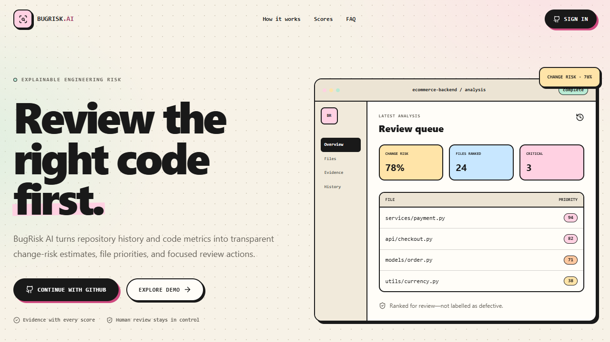
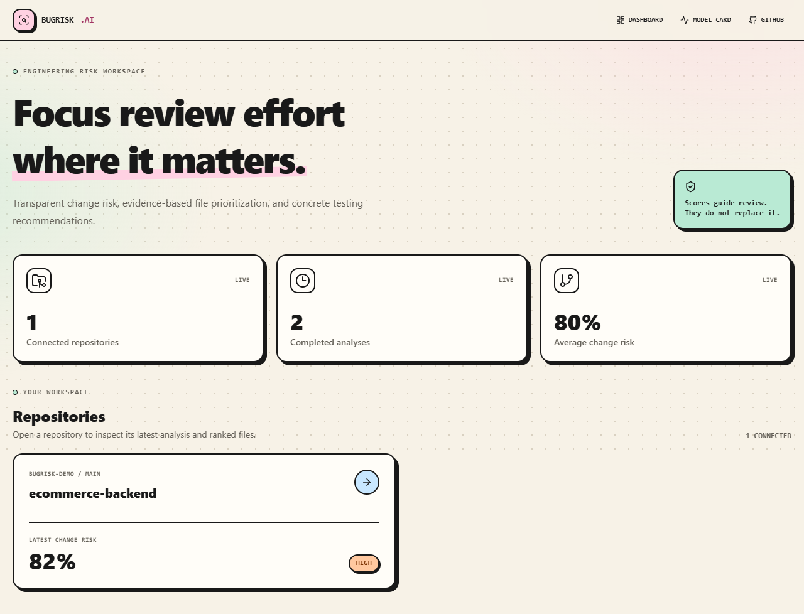

# BugRisk AI

BugRisk AI is an explainable engineering-risk dashboard for Python repositories. It predicts
the risk of an analyzed **commit/change**, then derives a separate **file-priority score** to
help reviewers and QA engineers decide where to spend attention. A file-priority score is not
a claim that the file contains a bug.

## What is included

- Next.js 16 dashboard with responsive repository, file-evidence, history, and model views.
- FastAPI REST API with GitHub OAuth, encrypted server-side tokens, secure sessions, and
  ownership checks.
- PostgreSQL/Supabase-ready schema and RLS policies; SQLite is used for the zero-config demo.
- Database-backed analysis states and a separate worker process.
- Temporary, authenticated Git clones with Python metrics from Git history, AST, and Radon.
- ApacheJIT preprocessing, temporal per-project splits, model comparison, sigmoid calibration,
  SHAP explanations, MLflow logging, and DVC stages.
- Deterministic, evidence-backed recommendations. No LLM is allowed to create risk scores.
- Docker Compose, Render, Vercel, and GitHub Actions configuration.

GitHub PR comments, CodeBERT, GRU, and GNN models are intentionally deferred until after the
MVP baseline is validated.

## Interface preview

| Landing page | Repository dashboard |
| --- | --- |
|  |  |


## Quick start: demo mode

Requirements: Python 3.11+, Node.js 22+, pnpm 11+, and Git.

```powershell
Copy-Item .env.example .env

Set-Location backend
python -m venv .venv
.\.venv\Scripts\Activate.ps1
pip install -e ".[dev]"
uvicorn app.main:app --reload
```

In another terminal:

```powershell
Set-Location frontend
corepack pnpm install
corepack pnpm dev
```

Open `http://localhost:3000/dashboard`. With `DEMO_MODE=true`, the API seeds one completed
repository analysis and does not require credentials. API documentation is available at
`http://localhost:8000/docs`.

## Train the ApacheJIT model

The official ApacheJIT v2 archive is downloaded from Zenodo record `5907847`. The archive is
82.8 MB and contains `apachejit_total.csv`, whose `buggy` field is the commit-level target.

```powershell
pip install -e ".\backend[ml]"
dvc repro
```

The stages download the dataset, normalize its feature columns, split each project in temporal
60/20/20 order, compare Logistic Regression, Random Forest, and XGBoost, calibrate the selected
model, select a recall-aware F2 operating threshold on validation data, and export
`ml/artifacts/bugrisk_model.joblib`. The threshold is used for evaluation reporting only; the
API continues to return calibrated probabilities and the fixed product risk bands. DVC records
dataset and pipeline hashes;
MLflow records the selected model and test metrics when installed.

## GitHub OAuth

Create a GitHub OAuth App with callback:

```text
http://localhost:8000/auth/github/callback
```

Set `GITHUB_CLIENT_ID`, `GITHUB_CLIENT_SECRET`, a random `SESSION_SECRET` of at least 32
characters, and a Fernet `TOKEN_ENCRYPTION_KEY`. Disable demo mode. Tokens are encrypted before
storage and are never sent to the frontend or placed in Git command arguments.

## Supabase

Create a Supabase project, open its SQL editor, and apply
`backend/supabase/migrations/001_initial_schema.sql`. Set `DATABASE_URL` to the pooled PostgreSQL
connection string used by the API and worker. The migration enables ownership RLS policies on
all seven application tables; the API also performs explicit ownership checks.

## Docker

After creating `.env`:

```powershell
docker compose up --build
```

Compose starts PostgreSQL, API, worker, and frontend. In Compose, `INLINE_WORKER=false` ensures
only the worker consumes queued analyses.

## Quality checks

```powershell
python -m ruff check backend ml scripts
python -m mypy --config-file backend/pyproject.toml --explicit-package-bases backend/app ml
python -m pytest backend/tests ml/tests --cov=backend/app

Set-Location frontend
corepack pnpm lint
corepack pnpm typecheck
corepack pnpm test
corepack pnpm build
```

See [architecture](docs/architecture.md), [deployment](docs/deployment.md), and
[security](SECURITY.md) for operational details.
